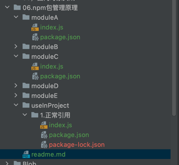

#前端npm包管理探究
Npm是常见的包管理工具 我们常用的包关系错综复杂 webpack打包时会引用各种包， 每个包又会有多个版本，不同的包有可能同一个包的不同版本，所以现在就其原理做一个总结。

`npm config set registry http://172.31.4.51:8081/repository/npm-hosted/`

新建目录如下文件夹：

将每个包发不到前端nexus仓库进行托管。

`
已知条件如下
a@1.0.0 --> b@1.0.0 --> c@1.0.0
`

