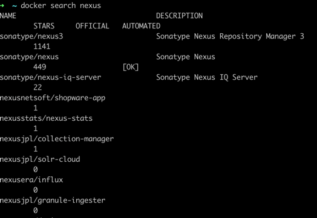
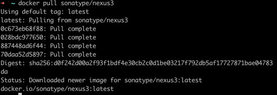

#docker安装nexus

- 指定私服的中央地址，
- 将自己的Maven项目指定到私服地址，
- 从私服下载中央库的项目索引，
- 从私服仓库下载依赖组件，
- 将第三方项目前端版本上传到私服供其他项目组使用。

###1.指定私服的中央地址


###2.查询下载镜像
查询
```$ docker search nexus```


下载
```$ docker pull sonatype/nexus3```



###3.新建挂载文件夹 赋予权限
```$ mkdir /usr/local/docker/nexus/data```

###4.启动镜像命令

```$ docker run -d -p 8081:8081 --name nexus -v /usr/local/docker/nexus/data:/var/nexus-data --restart=always docker.io/sonatype/nexus3```

###5.重置密码  进入容器内 

```
$ cd /opt/sonatype/sonatype-work/nexus3/ 
$ vi admin.password
```
