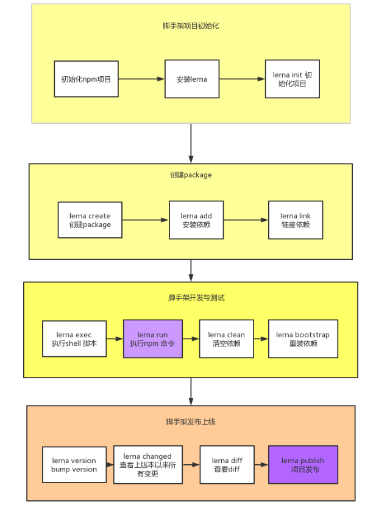
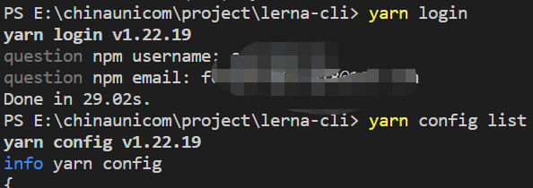
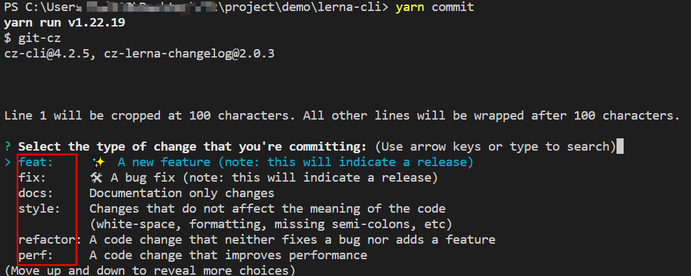
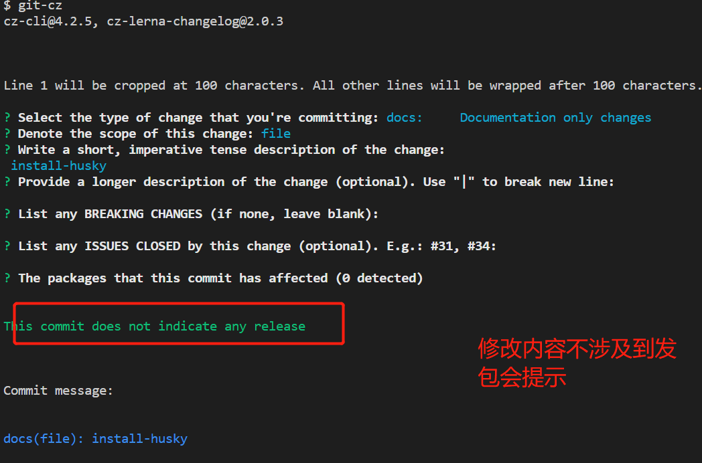
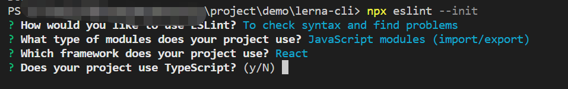
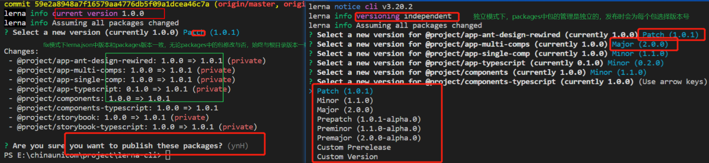
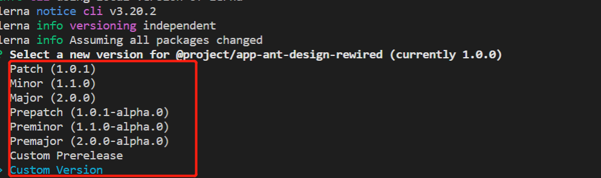
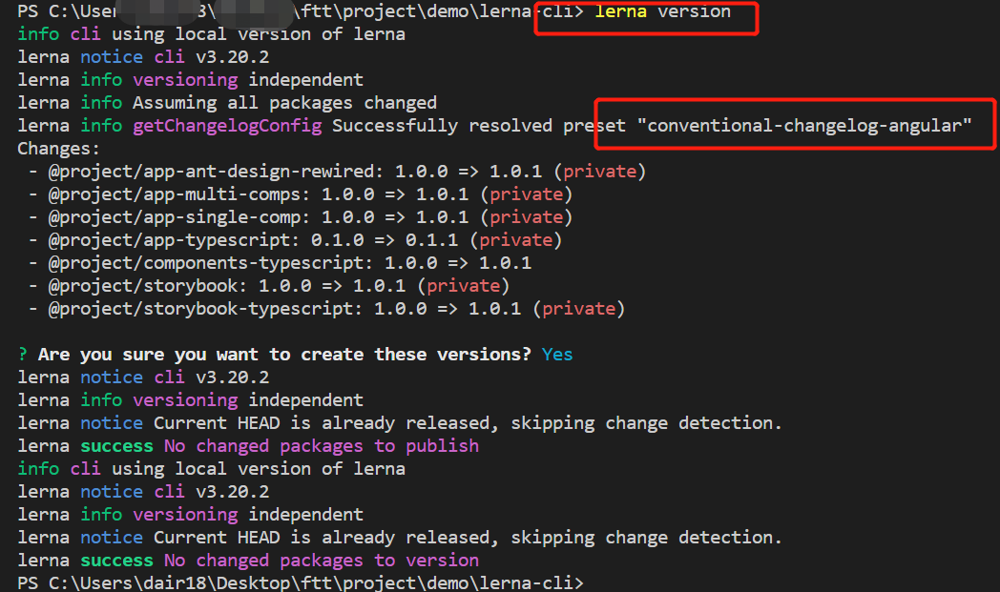
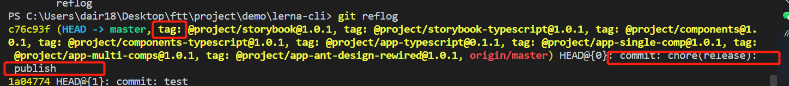
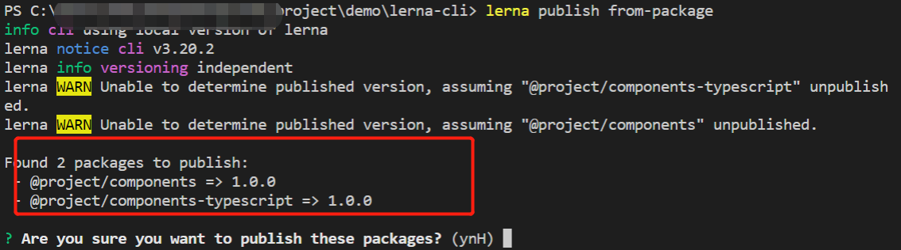

# 简介

通过lerna+yarn+react+ts的方式来管理包,lerna的独立模式会让每个包单独发布和管理，创建lerna+monorepo项目是需要采用独立模式进行创建，项目搭建使用的规范，发布的规范，npm发包流程，版本管理等。本项目搭建环境实现：

- 采用Independent模式
- eslint规则检查
- prettier自动格式化代码
- 遵循semver版本规范
- 条件验证husky: 如验证测试是否通过，是否存在未提交的代码，是否在主分支上进行版本发布操作
- version_bump:发版的时候需要更新版本号，这时候如何更新版本号就是个问题，一般大家都会遵循 semVer语义，
- 生成changelog: 为了方便查看每个package每个版本解决了哪些功能，我们需要给每个package都生成一份changelog方便用户查看各个版本的功能变化。
- 生成git tag：为了方便后续回滚问题及问题排查通常需要给每个版本创建一个git tag
- git 发布版本：每次发版我们都需要单独生成一个commit记录来标记milestone
- 发布npm包：发布完git后我们还需要将更新的版本发布到npm上，以便外部用户使用

# lerna脚手架使用流程

解决痛点：

- 减少重复性的工作（多package本地link、本地依赖、单元测试、代码提交、代码发布）
- 版本一致性（发布时版本一致性和发布后版本升级）



# [lerna命令](https://github.com/lerna/lerna/tree/main/commands)

[lerna官网文档](https://lerna.js.org/),[lerna命令使用文档](https://github.com/lerna/lerna/tree/main/commands)

```
1.全局安装lerna（管理员权限）
npm i lerna -g |yarn global add lerna
lerna  init --independent （创建独立模式的monorepo仓库）

2.项目安装依赖
lerna bootstrap --hoist | yarn install   //--hoist通过传递对包进行重复数据删除，通过生成软链接方式，根目录有的，不会在子目录中安装

3.包是否发生变化
lerna updated  | lerna diff  //修改指定包，可查对应修改的包和依赖被修改的包，辅助检查
lerna changed //列出下次发包更新的包

4.显示各个packages的version
lerna ls  | lerna list

5.清理node_modules
lerna clean (注意只能清除packages下node_modules,并不能删除根目录下面的node_modules,
建议：根目录执行脚本"clear-all": "rimraf node_modules && lerna clean -y")

6.运行shell脚本
$ lerna run <script> -- [..args] # 在所有包下运行指定

# 例如
$ lerna run test # 运行所有包的 test 命令
$ lerna run build # 运行所有包的 build 命令
$ lerna run --parallel watch # 观看所有包并在更改时发报，流式处理前缀输出

$ lerna run --scope my-component test # 运行 my-component 模块下的 test

7.创建packages包
lerna create <packagesname> [--dev] [--exact] //exact表示安装精确版本

8.发包
$ lerna publish # 用于发布更新
$ lerna publish --skip-git # 不会创建git commit或tag
$ lerna publish --skip-npm # 不会把包publish到npm上
$ lerna ls //列出当前lerna仓库中所有的公共软件包（注意公有的包才能发布【需要设置为public】，私有的需要付费）

9.安装依赖
$ lerna  add lodash --scope @ui/utils //指定packages安装依赖
$ lerna add packagesA --scope packageB //packages包内部安装依赖
$ lerna add <pluginname> //安装公共组件，会安装到根目录以及所有的子packages中的node_modules)(不建议，建议通过yarn workspace安装到根目录)

10.package内部包安装使用
$ lerna link //建立软连接，在package.json中引入内部包，运行该命令即可导入成功，
//package.json--devDependency
···
"devDependencies": {
    "@xxx/utils": "^1.0.4" // xxx为对应子包utils上面的package.json中的name
},
···
```


# yarn workspace命令

lerna中涉及到monorepo问题，通过yarn workspace命令来操作根目录和packages包

注意在使用yarn workspace需要在根目录的lerna.json中进行配置`"useWorkspaces": true,"npmClient": "yarn"`

```
1.多仓库安装（建议通过yarn处理依赖问题，通过lerna处理发布问题）
yarn install ====等价于====  lerna bootstrap --npm-client yarn --use-workspaces

2.执行所有packages下的clean|build操作(packages中script中需定义脚本)，该命令会执行所有packages中的脚本
yarn workspaces run clean|build...

3.运行指定包命令
yarn workspace <包名@ui/share> run clean|build

4.查看所有包之间的依赖
yarn workspaces info [json]

5.安装依赖
//根目录安装依赖
yarn add <pluginname> -D -W
yarn remove <pluginname> -D -W
···
yarn add lerna -D -W
npx lerna init  //初始化lerna.json
yarn add typescript -D -W
npx tsc --init //初始化tsconfig.json
···

6.指定packages下安装依赖（外部依赖）
yarn workspace <packagesname @ui/utils> add <pluginname> --
yarn workspace <packagesname @ui/utils> remove <pluginname> 

7.指定packages下安装依赖（内部依赖）
yarn worksapce <packagesname@ui/share> add <packagesname @ui/utils>
```


# 环境配置

1.git代码管理）
- 初始化git仓库`git init`,
- 创建git远程仓库，关联本地仓库

2.npm仓库
packages中管理的插件发布到官网或者私有服务器上(提供测试仓库：https://github.com/features/packages)

- 正确的仓库地址和用户名
```
1.查看本地npm registry 地址
npm config ls

2.切换需要发布的地址上（这里以npm官网为例）
两种方式切换源
（1）nrm方式
nrm ls
nrm use npm 
(1) 全局注册
npm config set registry https://registry.npmjs.org/
npm config get registry

3.npm官网注册账户并登录
https://www.npmjs.com/

4.电脑终端登录账户密码（见下图）
 yarn login //登录用户
 npm whoami //查看当前用户
 npm unpublish <--force>// 撤销发布(不建议)
 npm deprecate <pkg>[@<version>] <message> //建议使用
5.提交代码之后发布包（具体发包流程见多版本管理）
lerna publish //注意在发包之前先提交代码
```



# 规范化配置

##  1.[ commitizen 提交规范](https://www.conventionalcommits.org/en/v1.0.0/)

- 安装插件

```
yarn add  commitizen cz-lerna-changelog -D -W //根目录安装提交规范
```

- 根目录package.json增加配置config

```
"config": {
    "commitizen": {
      "path": "./node_modules/cz-lerna-changelog"
    }
  },
```

- commitizen并非采用全局安装（或者也可在全局安装直接使用命令`git-cz`来提交），配置script脚本,运行`yarn commmit` 结果如下图所示，提交type选择见[commitien官网](https://www.conventionalcommits.org/en/v1.0.0/)

```
"script":{
	"commit":"git-cz"
}
```



| type  | desc     | type     | desc                             |
| ----- | -------- | -------- | -------------------------------- |
| feat  | 新增功能 | fix      | 修复bug                          |
| docs  | 更改文档 | style    | 样式调整（空格，格式化，分号等） |
| build | 构建相关 | refactor | 重构，无修复bug和添加功能        |
| perf  | 性能优化 | revert   | 回退commit版本                   |

## 2.commitlint && husky提交格式化

 校验的工作由 commitlint 来完成，校验的时机则由 husky 来指定。husky 继承了 Git 下所有的钩子，在触发钩子的时候，husky 可以阻止不合法的 commit,push 。用户在使用规范化提交方式提交就会提交失败

- 安装插件

```
yarn add  @commitlint/cli @commitlint/config-conventional -D -W
```

- 根目录配置文件 commitlint.config.js 

```
module.exports = { 
    extends: ['@commitlint/config-conventional'] 
}
```

- 安装husky`yarn add  husky -D -W`
- 根目录package.json添加`"husky"`

```
"husky": { 
         "hooks": { 
            "commit-msg": "commitlint -E HUSKY_GIT_PARAMS" 
     }
 }
```

 "commit-msg":是git提交时校验提交信息的钩子，当触发时便会使用 commitlit 来校验 ,提交不符合规范不能提交

安装后提交`yarn commit`图见下



## 3.eslint && lint-staged代码规范化

 `lint-staged staged` 是 Git 概念，表示暂存区，`lint-staged` 只检查并矫正暂存区中的文件提高校，可以校验效率，不会改变老的项目

- 安装插件`yarn add   standard lint-staged -D  -W`

- 配置根目录package.json

```
"lint-staged": {
    "*.ts": [
      "eslint --fix",
      "git add"
    ]
  },
```

- 安装eslint（eslint的配置文件这里主要放在packages下的子包）

```
yarn add eslint -D -W
//初始化，可以选择不同风格和编码，见下图
npx eslint --init
```



# 多包版本管理和规范

lerna是monorepo项目，涉及不同包之间存在不同版本号的管理，在创建lerna项目采用独立模式创建，不同packages维护自身的版本号。发布之前需进行《环境配置环节》

## 1.monorepo独立模式配置

- 初始化独创建为独立模式`lerna init --independent`

- 修改根目录配置

  ```
  {
    "packages": ["packages/*"],//引入包名
    "useNx": true,
    "useWorkspaces": true,
    "npmClient": "yarn", //允许使用yarn workspace命令安装
    "version": "independent",
    "npmClient": "yarn", //运行命令的客户端(也可以根据每个命令单独指定)。设定为"yarn"则使用yarn运行。默认值是"npm"
    "command": {
      "run": {
        "npmClient": "yarn" //运行指令的时候
      },
      "publish": {
        "ignoreChanges": ["ignored-file", "*.md"],//通配符的数组，其中的值不会被 lerna 监测更改和发布。使用它可以防止因更改发布不必要的新版本，比如仅仅是修复 README.md 的错误。
        "message": "chore(release): publish",//执行发布版本更新时的自定义提交消息。更多细节见@lerna/version
        "registry": "发布的仓库名称"  //设置要发布的自定义注册 url，而非 npmjs.org，如果需要的话，您必须经过授权,也可不用写，直接设置registry发包
  
      }
    }
  }
  ```

fix模式和独立模式的区别在发布的区别见下图



## 2.packages中不同包packages.json配置

- packages中的子包名package.json中的包名如果是`@/package/name`带有的为private权限，如果要设置为公有的，需要做如下设置，此时才可进行发布，私有的情况下发包需要付费。

```
"publishConfig": {
    "access": "public"，
     // "registry": "",//单个包配置npm地址
  },
```

- 不同packages中管理的仓库发布与否，通过packages中的子包的package.json的`"private":true`,设置为私有，在`lerna publish`不会被发布，可通过`lerna ls`查看当前的可以发布插件

## 3.发布

### 3.1发布规范（语义化版本[semver](https://semver.org/)控制）

**语义化版本格式**：主版本号（major）.次版本号（minor）.修订号（patch）

- 主版本号：不兼容的 API 修改（进行不向下兼容的修改）
- 次版本号： 向下兼容的功能性增加（API 保持向下兼容的新增及修改）
- 修订号：向下兼容的问题修正（修复问题但不影响 API）

**版本选择**

- patch： 升级补丁版本号 
- minor： 升级小版本号 
- major： 升级大版本号 
- prepatch、preminor、premajor、prerelease：先行版本
  - 内部版本alpha：内部版本较多，处于开发阶段，存在bug，开发人员使用阶段
  - 公测版本beta：错误解决阶段，相较于alpha还需ui测试
  - rc：正式版本的候选阶段
- custom ：手动输入版本号
- custom version



**版本范围通配符**

|              符号              |                             描述                             |
| :----------------------------: | :----------------------------------------------------------: |
|              `^`               | 表示同一主版本号中，不小于指定版本号的版本号<br>`^2.2.1` 对应主版本号为 2，不小于 `2.2.1` 的版本号，比如 `2.2.1`、`2.2.2` |
|               ~                | 表示同一主版本号和次版本号中，不小于指定版本号的版本号<br>`~2.2.1` 对应主版本号为 2，次版本号为 2，不小于 `2.2.1` 的版本号，比如 `2.2.1、2.2.2` |
| `>`、`<`、`=`、`>=`、`<=`、`-` | 用来指定一个版本号范围<br> `>2.1`  `1.0.0 - 1.2.0` // 注意使用 `-` 的时候，必须两边都有空格。 |
|              `||`              |                       表示或 `^2 <2.2`                       |
|         `x`、`X`、`*`          |    `*` 对应所有版本号 `3.x` 对应所有主版本号为 3 的版本号    |

### 3.2发布流程

- 发布流程(发布之前提交代码)

  ```
  1. 运行lerna updated来决定哪一个包需要被publish
  2. 如果有必要，将会更新lerna.json中的version
  3. 将所有更新过的的包中的package.json的version字段更新
  4. 将所有更新过的包中的依赖更新
  5. 为新版本创建一个git commit或tag
  6. 将包publish到npm上
  7.撤销版本unpublish
  ```

- [`lerna publish`见文档](https://github.com/lerna/lerna/tree/main/commands/publish) 发布版本

```
$ lerna version # 发布前进行版本确认
$ lerna publish # 用于发布更新,之前不进行lerna version操作时，直接使用该命令也会进行lerna version操作，不带参数情况走bump version操作
$ lerna publish --skip-git # 不会创建git commit或tag
$ lerna publish --skip-npm # 不会把包publish到npm上
$ lerna publish from-package # 即根据 lerna 下的 package 里面的 pkg.json 的 version 变动来发包（ps：发布首次发包场景）
$ lerna publish from-git # 即根据 git commit 上的 annotaed tag 进行发包
```

通过lerna version +lerna publish效果如下：





首次发包效果如下



- 下架版本`npm unpublish [<@scope>/]<pkg>@<version> `
